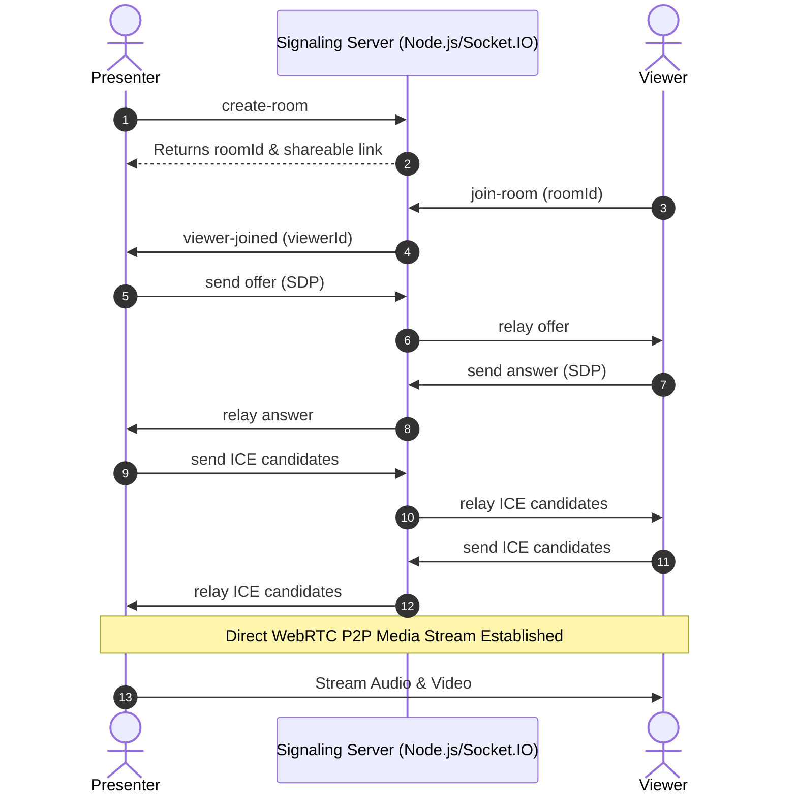

# 🖥️ WebRTC Screen Share

A real-time, peer-to-peer screen sharing web application built with **Node.js**, **Express**, **Socket.IO**, and **WebRTC**. Presenters can capture their screen/tabs/windows with audio and share a link with viewers for low-latency live streaming.

---

## ✨ Features

- **⚡ Low-Latency Streaming:** Peer-to-peer WebRTC streaming with minimal lag.
- **🔗 Instant Shareable Links:** Generate unique, short room URLs (e.g. `/view/:roomId`) in one click.
- **👥 Multi-Viewer Support:** Multiple viewers can connect to the same stream simultaneously.
- **🔊 Audio & Video Sharing:** Supports tab audio capture along with screen video.
- **📱 Responsive UI:** Dark-mode glassmorphic UI optimized for desktop and mobile viewing.
- **🛡️ Secure Signaling:** Socket.IO signaling with fallback support and graceful disconnect handling.
- **☁️ Cloud & Container Ready:** Out-of-the-box support for **Render**, **Docker**, and **Kubernetes**.

---

## 🏗️ Architecture



---

## 🚀 Quick Start (Local Development)

### Prerequisites

- [Node.js](https://nodejs.org/) (v18 or higher recommended)
- `npm` (bundled with Node.js)

### Installation

1. **Clone the repository:**
   ```bash
   git clone https://github.com/<your-username>/<your-repo-name>.git
   cd <your-repo-name>
   ```

2. **Install dependencies:**
   ```bash
   npm install
   ```

3. **Start the server:**
   ```bash
   npm start
   ```

4. **Open in browser:**
   - Presenter: [http://localhost:3000](http://localhost:3000)
   - Click **"Start Sharing"** to create a room and copy the viewer link.

---

## 🌐 Deploy to Render

This repository includes a [`render.yaml`](./render.yaml) blueprint for 1-click or automated deployment.

### Option 1: Automatic Blueprint (Recommended)
1. Push this repository to GitHub/GitLab.
2. Go to [Render Dashboard](https://dashboard.render.com/) → **New +** → **Blueprint**.
3. Connect your repository — Render will automatically configure the Web Service and health checks.

### Option 2: Manual Web Service Setup
1. Go to [Render Dashboard](https://dashboard.render.com/) → **New +** → **Web Service**.
2. Connect your Git repository.
3. Configure the following:
   - **Environment:** `Node`
   - **Build Command:** `npm install`
   - **Start Command:** `npm start`
   - **Health Check Path:** `/health`
   - **Instance Type:** `Free` or `Starter`
4. Click **Create Web Service**.

> [!IMPORTANT]
> WebRTC screen capture (`navigator.mediaDevices.getDisplayMedia`) requires an **HTTPS** context. Render automatically provisions free SSL certificates for your custom or `*.onrender.com` domain.

---

## 🐳 Docker Deployment

You can also run the application as a Docker container:

```bash
# Build the Docker image
docker build -t webrtc-screen-share .

# Run the container on port 3000
docker run -d -p 3000:3000 --name webrtc-app webrtc-screen-share
```

Access the app at `http://localhost:3000`.

---

## 📁 Project Structure

```
├── public/
│   ├── css/
│   │   └── style.css         # Modern dark-theme styling
│   ├── js/
│   │   ├── presenter.js      # Screen capture & presenter WebRTC logic
│   │   └── viewer.js         # Viewer stream receiver & controls
│   ├── index.html            # Presenter dashboard
│   └── view.html             # Viewer page
├── Dockerfile                # Multi-stage production container
├── k8s-deployment.yaml       # Kubernetes Deployment & Service manifests
├── render.yaml               # Render Infrastructure-as-Code Blueprint
├── server.js                 # Express server & Socket.IO signaling relay
├── package.json              # Project metadata & dependencies
└── README.md                 # Documentation
```

---

## ⚙️ Environment Variables

| Variable | Default | Description |
| :--- | :--- | :--- |
| `PORT` | `3000` | Port on which the HTTP & WebSocket server listens. |
| `NODE_ENV` | `development` | Set to `production` in deployed environments. |

---

## 📄 License

This project is licensed under the [MIT License](LICENSE).
